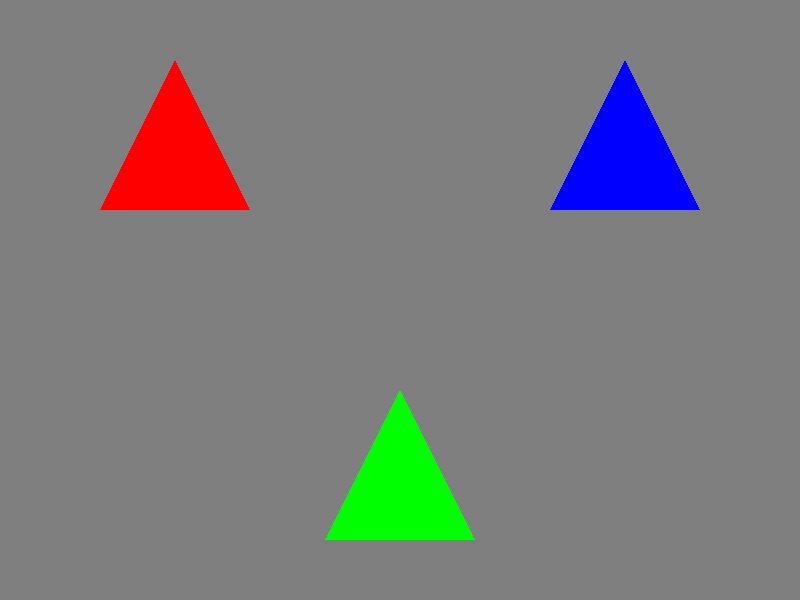

# ash-raytracing-example

An example of KHR raytracing using [ash](https://github.com/MaikKlein/ash) and [rust-gpu](https://github.com/EmbarkStudios/rust-gpu).

For more advanced example, please see `weekend` branch.
## Run

```bash
cargo run
```

open `out.png`



## See also

- [vulkan-tutorial-rust](https://github.com/unknownue/vulkan-tutorial-rust)
- [SaschaWillems / Vulkan](https://github.com/SaschaWillems/Vulkan)
- [Ray-Tracing-Gems-II](https://github.com/Apress/Ray-Tracing-Gems-II)